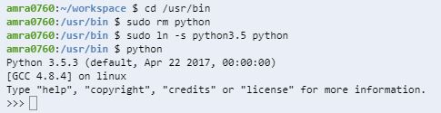

# 
 My Fifth Entry 

## Quick Recap
 This previous week, I was still trying to find myself a end goal and while in the process of doing so, I discovered that the platform I was running my code on wasn't the best way to execute python. Which is why I transferred over my code and projects to Cloud9. Here I had a clear command-line where I can run my code and display it. Moreover when I start using a MVC structure, I'll be able to view my code and keep track of all 3 parts more easily. 

## Some Conflicts
While in Cloud9, I discovered that I wasn't on the latest version of Python which was Python 3. I decided to look this up and found that Cloud9 has a built in settings. So I followed the steps which stated that I have to go in the preferences of Cloud9, then click on Python Support, and switch the Python version from 'Python2' to 'Python3'. 

Unfortunately, when I ran `python` in the command line, it still showed up as Python version 2.7 as shown below: 

I got frustrated because it *CLEARLY* states that I have Python 3.5 on file and so there should be no reason of why when I run `python` to check to see the current version that I'm running on, that I should get version 2.7. So I looked this up again using different keywords and I found yet another solution on the Cloud9 support community. It stated that I should go into my user bin `cd usr/bin`, then run `sudo rm python`, then run `sudo ln -s python3.5 python`. I then checked to see

## Takeaways 
* Persevere
* Use support communities
* Not every answer is going to suit your situation
* Alter your search

In conclusion, it's fine that you have some conflicts here and there, that's part of the learning process. However, these conflicts should never deter you from continuing on with your work. Using online support communities is recommended since those are _actual_ people out there with the same problem as you. However everyone's scenario is a little bit different so you should alter your search to your situation using some different keywords. 