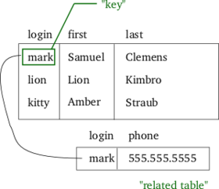

# <center> My Seventh Entry </center>

## Quick Recap
 This previous week, I was working on getting an MVP or a minimum viable product. In case you don't know what this means, take the following example. Can a baby run? The obvious answer is no. First it must crawl, then learn how  to stand on its own, then walk, then when it's finally ready it can run! Now this same concept has to do with my project. I can't just _run_ right away and make a massive project which will surely have a lot errors. No, I must first learn how to stand on my own, or _create_ an MVP. Which is what I've been trying to do this past week. I finally found myself an end goal and so I looked up several ways to get there. 
 
 I wanted to make a website that multiple users can sign in on and save all their passwords and usernames, because personally **I would be the number one user of this site.** I have a lot of passwords for a lot of different accounts and a lot of different usernames as well, so sometimes it's hard to me remember what I put for what and *especially* remember the case sensitivity. As a result, I thought why don't I just make some webapp that I would need to sign in once to and it would give my all my personal info so I wouldn't have to memorize anything except the username and password for that _one site_ only. Now I know what you're thinking. _"Oh you need databases for that", "Oh you should've done firebase", "Oh why'd you pick python?"_. And to that I say: I picked python for this very reason. If you remember in my first blog entry I said that I picked python because it's so versatile and vast. Yeah, here's where it comes in handy. I knew at the beginning I wasn't going to pick an end goal right away, but I needed something that covers a lot of ground so I can pick something out of it. So throughout some research I found two ways of getting there and they were MySQL and Django.

## A Quick Overview of MySQL
MySQL stands for Structured Query Language. Now I quickly want to address a common misconception about the word "MY" because I got a bit of a laugh when I found this out. The "My" in MySQL isn't what you think it means......... It's actually the name of the daughter of co-founder Michael Widenius. Her name is actually _just_ "My", it's not short for anything! Another interesting fact, MySQL has a slightly altered version, (so in other words A Fork!) of which is called MariaDB which also named after one of Widenius's daughters! Now let's get back on track address what MySQL does. 

MySQL is an open-source relational database management system. Open-source means that the code is free to use and modify. Relational in this context means that it's relational to a model (pictured down below) invented by Edgar F. Codd in 1969. In his model, all data is represented in terms of tuples(lists) and grouped into relations(sets of tuples). And finally, a database management system (self explanatory) is just a piece of software that handles data and all the modifications that come with it. MySQL serves giant sites like Google, Facebook, Twitter, ebay, Netflix, Github, Walmart, Uber and so much more.

 



## A Quick Overview of Django
Next is Django which is a open source web framework that's primary goal is to make the creation of complex and database-driven websites easy. A web framework is just a predefined structure of folders and files used to build websites and webapps, so that "you don't have to reinvent the wheel". Django follows a similar structure to the MVC structure pattern of which it's called MVT or MTV which both stand for the same thing: Model View Template. The difference between MVC and Django's MTV is that the View in Django is more like the Controller in MVC. Moreover, a Template in Django is like a MVC's View. Although this might confusing, it's actually quite simple. The View in a MVC structure serves the purpose of displaying the site to the user, that is the same functionality that the Template has in Django's MTV. Now the view in a MTV is similar to a Controller in an MVC in which they are both the bridge between the back end and the front end. However, they're different in that a controller uses programmed logic to control the information going from the model to View, while in a MTV View, the logic is handled in the Django framework itself.


## MySQL Setup
To start MySQL, you must input the following command in your bash terminal: ```$ mysql-ctl start ``` 

This basically translates to 'MySQL Control Start'. From there it will show that it's 'Starting a MySQL database server mysqid'. Then you must register to MySQL using the following command:
 ```$ mysql -u $C9_USER```
 
This might be different for everyone, but since I'm using Cloud9 IDE this command takes your Cloud9 username and uses it as the MySQL username. After this, a welcome note will be displayed and it will tell you some generic things like the copyright and trademark, but there's one thing you *need* to pay attention to and it's stated on the first line. It says 'Commands end with ;'. I can't _stress_ to you how many times I've written WHOLE lines of commands and then had to redo it because I was missing a semicolon at the end. The same thing also happened when I was working with php (which I will mention in a later entry). I should have known when I was syntax learning Python, because the number one rule in Python is that almost EVERYTHING ends with ;. Anyways moving on, from your terminal you must quit and sign in again with your username. 
 ```mysql> quit; 
    $ mysql -u 'userid'
 ```
From there you can check your databases by typing `SHOW DATABASES` and then picking one by `USE 'database_name'. One more thing I forgot to mention is that COMMANDS in mysql are uppercased and name are lowercased, not necessary but it helps for reading over.


## Conclusion/Takeaway 
* Persevere

In conclusion, I'll be using these two pieces of software to create my site. MySQL will act as my database that and Django will be the framework. The one thing that I want to be taken away from this is to push through. This might sound simple, but it's important to have that mindset because we are basically at homestretch and it's getting overwhelming.


