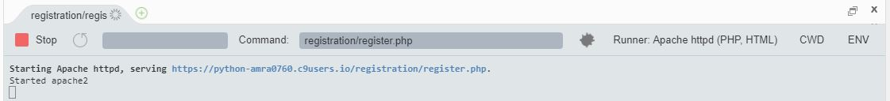
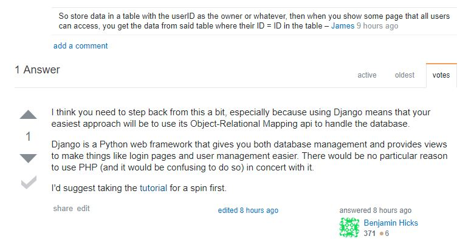

# 
 My Eighth Entry 

## Quick Recap
This previous week I was falling behind on some stuff because I decided on my project idea late, so as a result I got through **A TON** and that was only because _I had to_. I got down the gist of mySQL and now I can easily create, change, delete and use databases, tables, and rows. Along with mySQL, I also learned some php because mySQL is basically just command line which means only users that know how to operate the backend can use it and I didn't want that to be the case. So PHP stands for Hypertext Preprocessor and it's a widely-used open source scripting language that can be embedded into HTML and is especially suited for web development. These two are two of the things that make up LAMP which is an acronym for Linux, Apache, MySQL, and PHP. In LAMP (which is by the way is a web development platform), Linux is used as the operating system, Apache as the Web server, MySQL as the relational database management system and PHP as the object-oriented scripting language. Fortunately cloud9 got us covered with Apache, because when we click 'Run Project', Apache is the server running it. 
 

Moreover, using these resources I was able to finally make an mvp, sort of.... 

## Some Conflicts
The reason why I said 'sort of' is because it didn't come out the way I envisioned it to. So far I have created a fully functional login/register page (that you can try for yourself in the link down below) that is linked to my database, which means that YOU CAN ACTUALLY LOG BACK IN after you have registered and logged out (yes, exciting! I know.). However, so far I've been having trouble fulfilling my primary goal for the webapp, which is to allow users to store their usernames, passwords, and the site that it's for. I continually researching on how to do this since the backend part of it is pretty tricky. 

[Here is the link to my Github page of my mvp](https://github.com/amra0760/mysql_mvp)

I initially thought of making a table in my database for every user that creates an account, but through some research I learned that this was going to set me up for failure as not only would it be inefficient, but bad for security reasons and maintenance/debugging purposes as well. So from there I was _stuck_. I didn't know how to allow the user to enter data on the frontend after they had already registered and then be able to fully manage (create, change, delete, edit, etc.) it and have it also change in the backend. This gets even more trickier as everyone's initial solution to this often leads to one page where all the users are seeing the same thing, but I want each user to have personalized private information.

As you can see I dug myself into quite a hole here and I know most people would have changed their topic, if not have given up by now. However, this is why I said in my first entries, I said that I needed to find a topic that is attractive for me that I would be passionate about in case of times where I get into deep conflicts. Now here I am near the end with an _overwhelming_ problem that almost seems impossible. I conducted a lot more research which included questionnaires, blogs, tutorials, youtube videos and was not able to find anything. So I thought about my choices at the moment, and I landed on **asking the internet**. 

I never have really done this, usually it's me looking at other people's questions and answers and then altering it to my scenario, but this time I couldn't do that. So I took the liberty of making myself a stack overflow account and purposed a question! I never really expected that I would get an answer do the THOUSANDS of questions that go by each day, but shortly after I DID!

 

As shown my answer seemed to be that I was in too deep and that I should have started with Django first because that was designed to make web development much easier. I took this suggestion and started on my Django tutorial, and so far it is isn't looking that great. Since I'm running it on Cloud9, a lot of things are different such as when I run it. I've restarted the tutorial several times to see where I went wrong and couldn't find anything. Every time I try to run it, it tells me 'localhost server not available'. I looked up on how to set up Django on Cloud9 and it helped a bit, but I still wasn't able to run it properly. Which means it's time to ask the internet again. Unfortunately in stackoverflow, you only get one question a day so that their servers don't crash and so I guess I'll ask tomorrow.

## Conclusion/Takeaway 
* ASK THE INTERNET 

I **strongly** advise you to just ask your question online and it will save you _so_ much time. I hesitated to do this at first because I thought that there wouldn't be a chance that someone reads mine and so there's no point, but honestly you would be surprised. There's a lot and I mean A LOT of geniuses out there that are related to your field and more than one of them would be happy to help a beginner just like you. 

